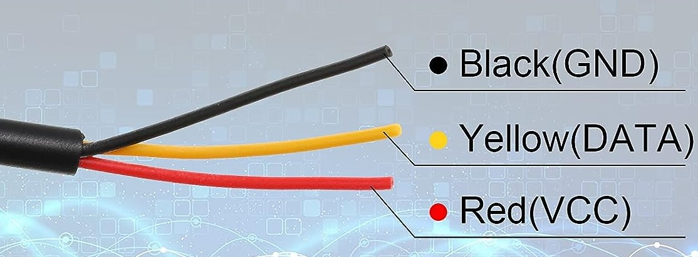
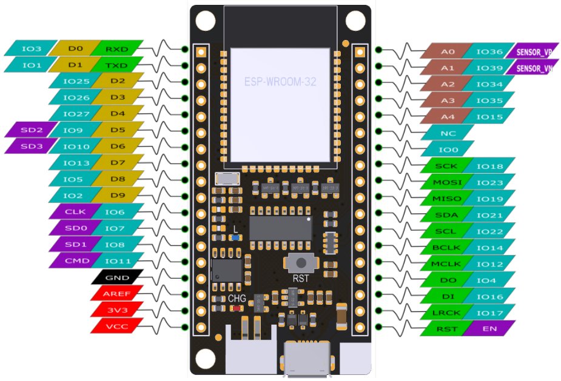

# Hardware
* [DFRobot Beetle](https://www.dfrobot.com/product-1798.html)
* [DFRobot FireBeetle ESP32](https://www.dfrobot.com/product-1590.html)
    * [Product Wiki](https://wiki.dfrobot.com/FireBeetle_ESP32_IOT_Microcontroller(V3.0)__Supports_Wi-Fi_&_Bluetooth__SKU__DFR0478)

# Reflashing with MicroPython

* Prerquisite Installations
    * [Python 3](https://www.python.org/downloads/)
    * [ESP Tool](https://github.com/espressif/esptool#manual-installation)

* MicroPython Binary Downloads
    * [MicroPython ESP32](https://micropython.org/download/esp32/)
    * [MicroPython ESP8266](https://micropython.org/download/esp8266/)

* Reflash per [DFRobot](https://www.dfrobot.com/blog-682.html)
    1. Erase flash: `esptool.py --port <COM PORT> erase_flash`
    1. Write binary to flash: 
        1. For the Beetle:
        `esptool.py --port <COM PORT> --baud 460800 write_flash --flash_size=detect 0 <pathToYourFile/binaryFile>`
        1. For the Fire Beetle: ([per](https://creatronix.de/using-micropython-on-firebeetle-esp32/))
        `esptool.py --port <COM PORT> --baud 460800 write_flash --flash_size=detect -z 0x1000 <pathToYourFile/binaryFile>`
        note the location offset `-z`

        Note: May want to use 115200 baud if there are data issues.

* [ESP32 MicroPython Release](https://micropython.org/download/#esp32)
    * [ESP32 Quick Reference](https://docs.micropython.org/en/latest/esp32/quickref.html)

# Temperature Sensor Design

* [Good article](https://www.electroniclinic.com/temperature-sensor-types-their-use-with-arduino-esp8266-and-esp32/) on temperature sensors for ESP32.        

* Sensors for project DS18B20
    * [Amazon](https://www.amazon.com/gp/product/B0924NBNZP/ref=ppx_yo_dt_b_asin_title_o01_s00?ie=UTF8&psc=1)
    * [Datasheet](./datasheets/DS18B20-datasheet.pdf)
    * Wiring:
     
        * Per datasheet, a 4.7k resistor is required between the data line and the power line.

* Firebeetle pinout:

    Note: Iuse the "IO" pin numbers (cyan labels) for the pin numbers in MicroPython.